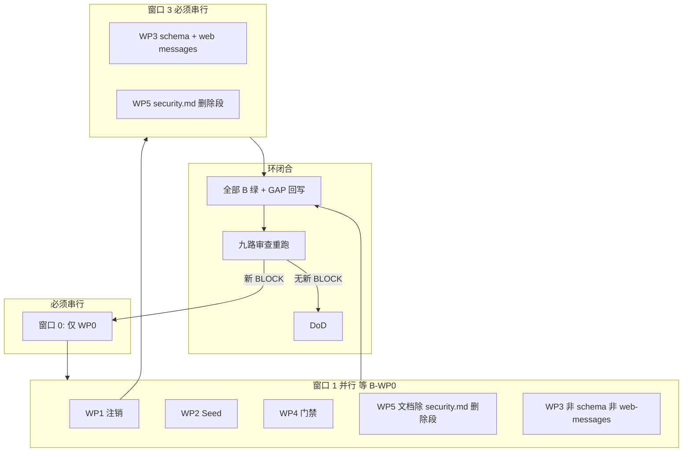

# Agent 地图

> [Index](./README.md) · [A 实施](./A-IMPLEMENT.md) · [B 验收](./B-VERIFY.md) · [Agent](./AGENT-MAP.md)

Agent 只能来自 `.claude/manifests/agent-workflow.yml` 注册表。严重级 `BLOCK` / `WARN` / `INFO` / `N_A`。并行审查必须真并行（`CLAUDE.md`）。

**HEAD**：`main` @ `6cd02a61`

---

## 包 → 执行 agent

| 包      | 实施 Owner            | 实施协助（并行）                                                                               | 验收 Owner（跑 B）    | 验收协助                                                 |
| ------- | --------------------- | ---------------------------------------------------------------------------------------------- | --------------------- | -------------------------------------------------------- |
| A/B-WP0 | `architect`           | `security-reviewer`、`test-engineer`                                                           | `test-engineer`       | `security-reviewer`                                      |
| A/B-WP1 | `security-reviewer`   | `data-model-reviewer`、`i18n-specialist`、`applicant-simulator`                                | `security-reviewer`   | `test-engineer`、`mobile-specialist`（en 文案/手机路径） |
| A/B-WP2 | `architect`           | `test-engineer`、`study-abroad-expert`                                                         | `test-engineer`       | `architect`                                              |
| A/B-WP3 | `study-abroad-expert` | `applicant-simulator`、`i18n-specialist`、`data-model-reviewer`、`design-reviewer`（未知徽章） | `applicant-simulator` | `test-engineer`、`study-abroad-expert`                   |
| A/B-WP4 | `test-engineer`       | `architect`、`mobile-specialist`                                                               | `test-engineer`       | `architect`                                              |
| A/B-WP5 | `feedback-processor`  | `security-reviewer`、`architect`                                                               | `feedback-processor`  | `integration-checker`                                    |

同一人/同一 agent 类型可以先后跑 A 再跑 B，但 **B 必须按 B-VERIFY 的失败释义执行**，不得用「我刚写的代码」当证据。

Phase 2 强制（每个落地 PR，不只最后一次）：`integration-checker` + `test-engineer`。用户可见（WP1 UX、WP3 全部）：再加 `user-journey-auditor`。

---

## 文件所有权（禁止两包改同一文件）

冲突时 **串行**，不是「各改各的 hunk」。

| 文件 / 区                                                                                                      | 独占包                                              | 何时释放                                                    |
| -------------------------------------------------------------------------------------------------------------- | --------------------------------------------------- | ----------------------------------------------------------- |
| `package.json` overrides、`pnpm-lock.yaml`                                                                     | WP0                                                 | B-WP0 绿                                                    |
| `.github/workflows/osv-audit-scheduled.yml`                                                                    | WP0                                                 | 新建后仍归 WP0                                              |
| `scripts/check-gate-proofs.ts`、`scripts/gate-proofs/harness.ts`                                               | WP0                                                 | B-WP0 绿后 WP4 才可扩「扫描 apps/*/scripts」                |
| `docs/SECURITY_DEPS.md`                                                                                        | WP0                                                 | B-WP0 绿                                                    |
| `apps/api/src/modules/user/**`                                                                                 | WP1                                                 | B-WP1 绿                                                    |
| `apps/api/src/common/storage/storage.service.ts*`                                                              | WP1                                                 | B-WP1 绿                                                    |
| `apps/api/src/common/redis/cron-lock.util.ts*`                                                                 | WP1                                                 | B-WP1 绿                                                    |
| `apps/api/src/common/cron/internal-cron.controller.ts*`                                                        | WP1                                                 | B-WP1 绿                                                    |
| `scripts/ci/sync-cloud-scheduler.mjs`                                                                          | WP1                                                 | B-WP1 绿                                                    |
| `scripts/check-deletion-promise.ts` 及 proof                                                                   | WP1                                                 | B-WP1 绿                                                    |
| `apps/web/src/app/[locale]/(main)/settings/page.tsx`                                                           | WP1                                                 | B-WP1 绿                                                    |
| `apps/web/src/app/[locale]/(main)/settings/security/page.tsx`                                                  | WP1                                                 | B-WP1 绿                                                    |
| `apps/mobile/src/lib/i18n/locales/{zh,en}.json`                                                                | WP1                                                 | B-WP1 绿                                                    |
| `apps/web/src/messages/{zh,en}.json`                                                                           | **WP1 窗口 1 独占** → **WP3 窗口 3 独占**           | B-WP1 绿后交给 WP3                                          |
| `apps/api/prisma/schema.prisma` + 新 migration                                                                 | **WP1 窗口 1 独占** → **WP3 窗口 3 独占**           | B-WP1 绿后交给 WP3                                          |
| `apps/api/migrate.sh`                                                                                          | WP2                                                 | B-WP2 绿                                                    |
| `apps/api/scripts/verify-seed.ts`、`scripts/check-seed-pipeline-parity.ts*`                                    | WP2                                                 | B-WP2 绿                                                    |
| `essays-tab.tsx`、testingPolicy UI、timeline-application、team-recruitment、seed-forum-posts、competition JSON | WP3                                                 | 可与 WP1 并行（非 schema/messages）                         |
| `apps/api/src/modules/prediction/**` 持久化/唯一键消费者                                                       | WP3                                                 | 等 schema 窗口                                              |
| `.github/workflows/ci.yml`                                                                                     | WP4                                                 | 注释里过时的 `ENABLED=false` 由 WP4 顺手改，WP5 不出手 YAML |
| `.github/workflows/mobile-ci.yml`                                                                              | WP4                                                 | B-WP4 绿                                                    |
| `playwright.config.ts`、`e2e/**`                                                                               | WP4                                                 | B-WP4 绿                                                    |
| `apps/web/scripts/check-code-quality.ts`                                                                       | WP4                                                 | B-WP4 绿                                                    |
| `scripts/check-audit-gate.ts`                                                                                  | WP4                                                 | B-WP4 绿                                                    |
| `packages/browser-extension/**`                                                                                | WP4                                                 | B-WP4 绿                                                    |
| 13 个 app `check-*.ts` 的 **proof 新文件**                                                                     | WP4                                                 | 不改 gate 源码除非修早退（code-quality 已独占）             |
| `docs/USER_FEEDBACK_ANALYSIS_2026-08-05.md`                                                                    | WP5                                                 | 计划作者已改 Secondary 两行；WP5 只扫/补                    |
| `.claude/rules/security.md`                                                                                    | WP5                                                 | **B-WP1 之后**才改删除段                                    |
| `docs/DEPLOY_CONFIG.md`、`docs/RELEASE_GATE_ONE_PAGER.md`                                                      | WP5                                                 | 可与 WP0 后窗口 1 并行                                      |
| `docs/closure-ring-2026-08-16/**`                                                                              | 跑 B 的 agent 回写 GAP；禁止改 A/B 判据来迁就红探针 | —                                                           |

未列出的文件：先在本表加一行再改。发现两包需要同一文件 → 停，更新本表，串行。

---

## 并行 vs 串行

### 窗口 0 — 只派 WP0

- 派：`architect` + `security-reviewer` + `test-engineer`（三人并行：CVE / workflow / harness，文件不撞）。
- 不派：任何要把 `pnpm lint:all` 或 `gh pr checks` 当证据的 B。
- WP1–4 可 **只读** 探路。

### 窗口 1 — B-WP0 绿之后并行

同时派（文件独占已分好）：

| 线程 | Agent                                                                | 包                                                                                          |
| ---- | -------------------------------------------------------------------- | ------------------------------------------------------------------------------------------- |
| 1    | security-reviewer + data-model-reviewer + i18n + applicant-simulator | A-WP1                                                                                       |
| 2    | architect + test-engineer                                            | A-WP2                                                                                       |
| 3    | test-engineer + architect + mobile-specialist                        | A-WP4（**先写 proof 文件与 mobile-ci**；扩 `check-gate-proofs` 扫描范围等 WP0 释放 runner） |
| 4    | feedback-processor + architect                                       | A-WP5 T5.1 / T5.3                                                                           |
| 5    | study-abroad-expert + applicant-simulator                            | A-WP3 的 T3.2–T3.6（不含 schema/messages/唯一键）                                           |

WP4 与 WP0 都碰 `check-gate-proofs.ts`：窗口 1 的 WP4 **禁止**改该文件，只加 `scripts/gate-proofs/*.proof.ts`。扩扫描 = 窗口 1.5，WP0 owner 签字释放。

### 窗口 3 — B-WP1 绿之后串行

1. **一个** data-model-reviewer：`schema.prisma` PredictionResult 唯一键（A-WP3 T3.7）。
2. **一个** i18n-specialist：web messages 营销/FAQ（A-WP3 T3.1）。
3. **一个** security-reviewer 或 feedback-processor：`security.md` 删除段（A-WP5 T5.2）。

这三步可彼此并行（三个不同文件），但都不得早于 B-WP1。

### 禁止

- 两个 agent checkout 同一独占文件。
- 用关 `ACCOUNT_PURGE_ENABLED` 让 WP1「看起来」过 B（除非决策树第一分支，且 B-WP1 P1.flag 记录）。
- 九路审查与实施抢同一 working tree 而不基于已提交 diff。

---

## WP1 内并行（同一包、文件仍不撞）

| 子线程          | Agent                          | 文件                                                                           |
| --------------- | ------------------------------ | ------------------------------------------------------------------------------ |
| 存储删除        | security-reviewer              | `storage.service.ts*`、verification/forum 删除路径                             |
| 孤儿表 + schema | data-model-reviewer            | `schema.prisma`、`user.service.ts` hardDelete、`user-data.service.ts`          |
| cron            | architect 或 security-reviewer | `cron-lock.util.ts`、`internal-cron.controller.ts`、`sync-cloud-scheduler.mjs` |
| 文案            | i18n-specialist                | mobile locales、web messages 注销 key、`check-deletion-promise.ts`             |
| UX              | applicant-simulator            | settings 两页 + API 密码                                                       |

`user.service.ts` 同时被「孤儿表」和「密码」需要：串行，data-model 先合 hardDelete 清单，applicant 再加密码校验。

---

## 九路审查重跑

原九路 BLOCK 已全部进入 GAP。闭合审查必须再跑这九路，范围 = **本环落地 diff**（不是整个 main）。输出格式遵从 manifest。

| #   | Agent                 | 盯什么                                                      | 早退 N/A 仅当                             |
| --- | --------------------- | ----------------------------------------------------------- | ----------------------------------------- |
| 1   | `security-reviewer`   | CVE、注销、存储删除、cron 5xx、开关/文案一致性              | diff 无 auth/vault/user/storage/ci 安全门 |
| 2   | `architect`           | migrate fail-loud、CI/schedule、min-backoff、deploy 边界    | diff 无 workflow/migrate/cron             |
| 3   | `data-model-reviewer` | 孤儿 FK、PredictionResult 唯一键、pending-decisions 计数    | diff 无 prisma/persistence                |
| 4   | `test-engineer`       | proof 开火、Playwright runner、gate 误诊、断言空表会红      | 永不 N/A（mandatory）                     |
| 5   | `i18n-specialist`     | 注销天数、Payment 例外、营销禁用词、LOCALES 扫描            | diff 无 messages/locales/deletion-promise |
| 6   | `mobile-specialist`   | mobile en 注销、mobile-ci 审计硬门                          | diff 无 `apps/mobile` 与 `mobile-ci.yml`  |
| 7   | `applicant-simulator` | 两次点击、security 红按钮、UNKNOWN 徽章、日历对学生是否可用 | diff 无学生可见 UI                        |
| 8   | `study-abroad-expert` | 托福/日历、组队结束赛、国家队、tracks、testingPolicy 诚实   | diff 无学校/竞赛/预测业务                 |
| 9   | `integration-checker` | API↔Web 删除契约、seed 断言数字、messages 与 FAQ            | 永不 N/A（mandatory）                     |

另加（用户可见时，不算「第九路」替代）：`user-journey-auditor`。  
`ai-prompt-engineer`：本环无 prompt 形状变更则 N/A。  
`design-reviewer`：UNKNOWN 徽章/对话框若改视觉则加；否则 N/A。

重审发现的每条 **新 BLOCK** → README 新 `G9.*` 行 + 新 A/B 对。没有 B 不准实施。

收尾：`.claude/skills/workflow-receipt.md` 写 receipt 到 `.claude/receipts/`。

---

## 实施 agent 开干前清单

1. 读本目录四份 MD 的徽章链接，确认自己的包和 B 包。
2. 读独占表，`git grep` 确认没有别人的未合并 diff 碰你的文件。
3. 读对应模块 `BRIEF.md` / 规则（vault → `security.md` 但 **先不要改它**；prediction → `docs/PREDICTION_SYSTEM.md`）。
4. 按 A 包做 + 按 close-the-loop 加 guardrail。
5. 把工作树交给 **验收 Owner** 跑 B，自己不给自己 CLOSED。
6. 验收 Owner 回写 GAP。失败保持 OPEN，连同命令输出。

---

## 本环此刻应派什么

**立即（串行窗口 0）：** A-WP0 三线程并行（overrides / scheduled workflow / harness 误诊），然后 **同一批 test-engineer 跑 B-WP0**。

**不要立即派：** A-WP3 唯一键、A-WP5 security.md 删除段、任何「先关 purge 开关」的活。

**WP0 绿后立即并行：** A-WP1、A-WP2、A-WP4、A-WP5（T5.1/T5.3）、A-WP3（T3.2–T3.6）。
