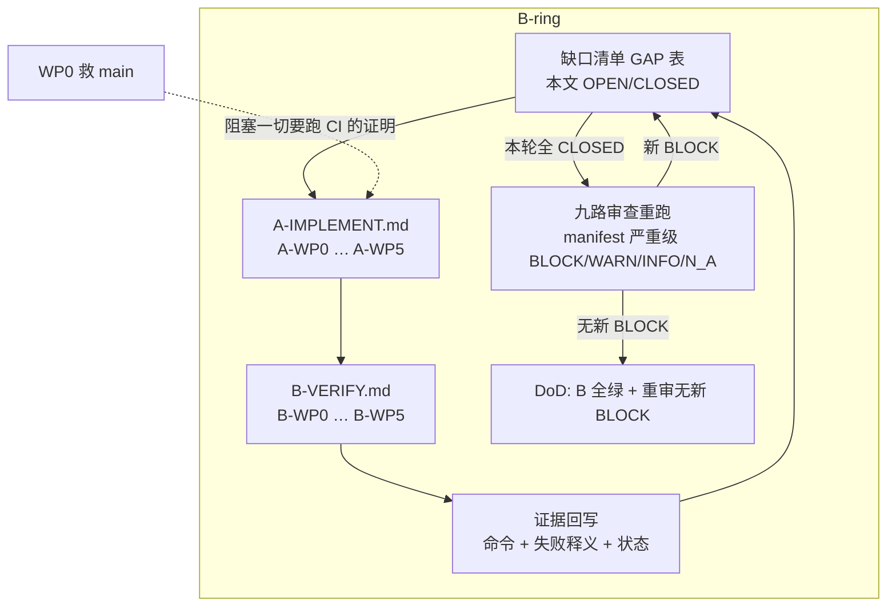
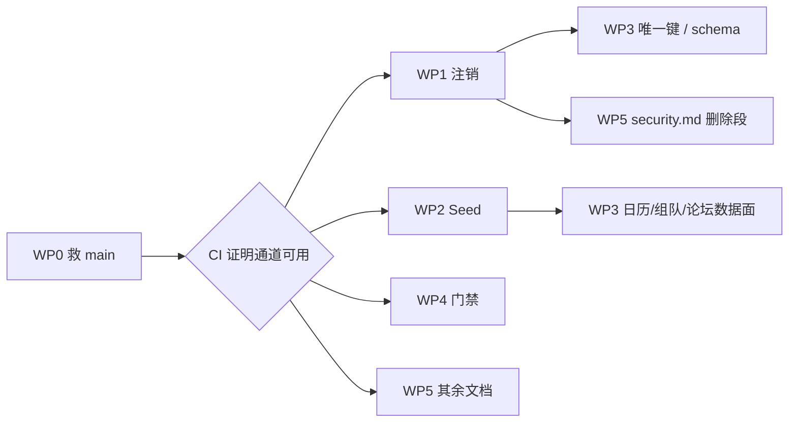

# B-ring 闭环计划 · 2026-08-16

> [Index](./README.md) · [A 实施](./A-IMPLEMENT.md) · [B 验收](./B-VERIFY.md) · [Agent](./AGENT-MAP.md)

**HEAD 钉死**：`main` @ `6cd02a61`  
**性质**：互相引用的执行环，不是愿望清单。没有对应 B 包的 A 包不准存在。  
**流程 SSOT**：`.claude/skills/close-the-loop.md`、`.claude/skills/verify-where-it-matters.md`、`.claude/manifests/agent-workflow.yml`、根目录 `CLAUDE.md`。本环不发明与之冲突的流程。  
**最后更新**：2026-08-17（集成官回写 GAP；落地分支 `fix/closure-ring-2026-08-16`）

---

## B-ring 是什么

不是「改完代码打勾」。整套 MD 必须构成一个环：

```
缺口清单 → A 实施包（谁做、改哪些文件、不做哪些）
        → B 验收包（可证伪判据、命令、失败即红的 gate）
        → 证据回写到缺口清单（CLOSED / OPEN）
        → 九路审查重跑（环闭合）
```

- **A 包**负责改代码/配置/文案，并按 `/close-the-loop` 加上能挡住同类回归的 guardrail。
- **B 包**负责按 `/verify-where-it-matters` 证明主张为真；每条主张必须写清「怎样证明它是假的」。
- **缺口清单**（本文 GAP 表）是环的账本：B 跑完必须回写 `CLOSED` 或保持 `OPEN`，禁止口头「好了」。
- **九路审查**按 `agent-workflow.yml` 的 Phase 1/2 重跑。新 BLOCK 写回 GAP，环重新转。

Definition of Done **不是**「PR 合进 main」。DoD = **B 环全绿 + 九路重审无新 BLOCK**。`merged ≠ production`（见 G5.3）。

---

## 环图



包一一对应（禁止有 A 无 B）：

| A 包                                              | B 包                                           | 主题                               |
| ------------------------------------------------- | ---------------------------------------------- | ---------------------------------- |
| [A-WP0](./A-IMPLEMENT.md#a-wp0-救-main)           | [B-WP0](./B-VERIFY.md#b-wp0-救-main)           | CVE / 定时审计 / gate-proof 误报   |
| [A-WP1](./A-IMPLEMENT.md#a-wp1-注销成真)          | [B-WP1](./B-VERIFY.md#b-wp1-注销成真)          | 注销=真删，文案=能力               |
| [A-WP2](./A-IMPLEMENT.md#a-wp2-seed-失败必须可见) | [B-WP2](./B-VERIFY.md#b-wp2-seed-失败必须可见) | seed fail-soft → 可见失败          |
| [A-WP3](./A-IMPLEMENT.md#a-wp3-对学生诚实)        | [B-WP3](./B-VERIFY.md#b-wp3-对学生诚实)        | 预测/日历/组队/论坛/文书诚实       |
| [A-WP4](./A-IMPLEMENT.md#a-wp4-门禁方法论补全)    | [B-WP4](./B-VERIFY.md#b-wp4-门禁方法论补全)    | proof / Playwright / 自动通道      |
| [A-WP5](./A-IMPLEMENT.md#a-wp5-文档自洽)          | [B-WP5](./B-VERIFY.md#b-wp5-文档自洽)          | 反馈表 / security.md / merged≠prod |

执行顺序、文件独占、并行窗口见 [AGENT-MAP.md](./AGENT-MAP.md)。

---

## 缺口清单（账本 · 证据回写处）

状态允许 `OPEN` / `PARTIAL` / `CLOSED`。`CLOSED` 必须带 B 探针与日期。`PARTIAL` = 本地/静态路径已验、生产路径未验。禁止用「代码已改」关闭。

| ID   | BLOCK 摘要（九路审查原样纳入）                                                        | A     | B     | 状态    | 证据                                                                                                                                                                                                              |
| ---- | ------------------------------------------------------------------------------------- | ----- | ----- | ------- | ----------------------------------------------------------------------------------------------------------------------------------------------------------------------------------------------------------------- |
| G0.1 | `nanoid@3.3.17` HIGH `GHSA-2v37-7h3g-55p8`；`pnpm.overrides` 钉在漏洞版 `>=3.3.17 <4` | A-WP0 | B-WP0 | CLOSED  | 2026-08-17 P0.1: `rg nanoid@3.3.17` 无命中；override `>=3.3.18 <4`；`pnpm exec tsx scripts/check-dependency-audit.ts` exit 0，0 unignored high/critical。若 lockfile 再出现 `nanoid@3.3.17:` 则本主张为假。       |
| G0.2 | 无 scheduled 依赖审计；CVE 可在 lockfile 不变时无限期存活                             | A-WP0 | B-WP0 | PARTIAL | 2026-08-17 P0.2: `.github/workflows/osv-audit-scheduled.yml` 有 `schedule:` cron `17 6 * * *`，跑同一 `check-dependency-audit.ts`，无 `continue-on-error`。`pnpm lint:audit-gate` 绿。第一次 GitHub cron 未触发。 |
| G0.3 | `lint:gate-proofs` 在干净树已红时误报「proof 失败」                                   | A-WP0 | B-WP0 | PARTIAL | 2026-08-17: runner 有 `BASELINE_RED` 分支。集成中途 `api-routes`+`file-size` 基线红时 stderr 写 `BASELINE_RED` 且「This is NOT "proof failed"」。未做人为弄红再还原的对照实验。                                   |
| G1.1 | `StorageService.deleteFile()` 零调用；blob 留在 COS                                   | A-WP1 | B-WP1 | OPEN    | 2026-08-17 P1.blob: `deleteFile`/`deleteFiles` 有 COS/S3/OSS 分支；`extractOwnedObjectKey` 单测绿。本环境未对生产 bucket Head/GET 证 404。未关 `ACCOUNT_PURGE_ENABLED`。                                          |
| G1.2 | ~14 张无外键 `userId` 表未接入 hardDelete                                             | A-WP1 | B-WP1 | PARTIAL | 2026-08-17 P1.orphan: `pnpm lint:orphan-userid` → 18 bare / 3 retained / 15 explicit hardDelete / 0 leaks。相关 API 单测绿。无生产 DB count 探针。                                                                |
| G1.3 | Payment 账号永不删，用户文案无例外                                                    | A-WP1 | B-WP1 | CLOSED  | 2026-08-17 P1.pay + P1.i18n: `pnpm lint:deletion-promise` → ENABLED、grace 30d、10 串 / 4 locale 文件一致；注销串含支付/财务例外。                                                                                |
| G1.4 | 加锁 cron 失败仍 HTTP 200；backoff 300s < lock TTL                                    | A-WP1 | B-WP1 | PARTIAL | 2026-08-17 P1.cron: `cron-lock.util.spec` 绿；`pnpm lint:cron-manifest` → min-backoff 3600s >= max lock TTL 3600s。Scheduler 真实 5xx 未验。                                                                      |
| G1.5 | mobile en 注销文案无 30 天；LOCALES 手写漏 en                                         | A-WP1 | B-WP1 | CLOSED  | 2026-08-17 P1.i18n: `pnpm lint:deletion-promise` 扫 4 locale 文件（含 mobile en），10 串均 30d。                                                                                                                  |
| G1.6 | 两次点击无密码即可软删；security 页只是 Link                                          | A-WP1 | B-WP1 | PARTIAL | 2026-08-17 P1.ux: `DeleteAccountDto.password`；settings+security 同一 mutation；无 `Link href="/settings"` 红按钮。未做浏览器点两次 / 无密码 HTTP 4xx。                                                           |
| G1.7 | 生产开关 true + 文案承诺 → 能力必须追上                                               | A-WP1 | B-WP1 | OPEN    | 2026-08-17 P1.flag: `ci.yml` 仍 `ACCOUNT_PURGE_ENABLED=true`；文案仍承诺 30 天+支付例外。G1.1 COS 未证。未关开关、未改承诺。                                                                                      |
| G2.1 | `migrate.sh` fail-soft；关键 seed 失败形态=空态                                       | A-WP2 | B-WP2 | PARTIAL | 2026-08-17 P2.soft: `pnpm lint:seed-parity` fail-hard labels: testing-policy, global-events, competitions, competition-data, match-pools, forum-communities。未跑假失败 migrate / 生产 job。                      |
| G2.2 | 生产内容断言缺失                                                                      | A-WP2 | B-WP2 | PARTIAL | 2026-08-17 P2.assert: `tsx apps/api/prisma/check-seed-result-assertions.ts` 静态绿（11/62/12/21/17）。`--db` 跳过。                                                                                               |
| G3.1 | 首页「精准录取预测 / 机器学习」vs FAQ 诚实                                            | A-WP3 | B-WP3 | CLOSED  | 2026-08-17: messages 无「精准录取/Accurate Admission/机器学习」；`tsx scripts/check-deprecated-terms.ts` 绿。                                                                                                     |
| G3.2 | UNKNOWN testingPolicy 徽章隐藏                                                        | A-WP3 | B-WP3 | PARTIAL | 2026-08-17: `showTestingPolicy = testingPolicy != null`；zh「未收录」。未数 ~166 所。                                                                                                                             |
| G3.3 | 考试日历无申请截止/托福；按 eventDate 排序                                            | A-WP3 | B-WP3 | PARTIAL | 2026-08-17: 按 `registrationDeadline ?? eventDate` 排序。托福未 sourced 补齐。                                                                                                                                    |
| G3.4 | 组队已结束排最前；国家队可自组；CompetitionTrack=0                                    | A-WP3 | B-WP3 | PARTIAL | 2026-08-17: 结束 edition 下沉；IMO/IPhO/IChO/IBO/IOI `selfJoinable: false`。未编造 tracks（仍 0）。                                                                                                               |
| G3.5 | 论坛 like/view 仍是 seed 随机数                                                       | A-WP3 | B-WP3 | PARTIAL | 2026-08-17: 新 seed like/view/comment like=0；migration 只清 demo 作者。存量非 demo 未清。默认 sort=`latest`。                                                                                                    |
| G3.6 | essays-tab 缺 keepPreviousData                                                        | A-WP3 | B-WP3 | PARTIAL | 2026-08-17: `placeholderData: keepPreviousData`；`pnpm --filter web lint:quality` 绿。未验 UI 翻页不闪骨架。                                                                                                      |
| G3.7 | PredictionResult 唯一键仍 (profileId, schoolId)                                       | A-WP3 | B-WP3 | PARTIAL | 2026-08-17: `@@unique([profileId, schoolId, applicationYear])` + migration `20260817000000`；pending distinct by school。单测绿。真实库未 apply。第三行 residual 仍 OPEN。                                        |
| G4.1 | apps/*/scripts 13 个质量门零 proof                                                    | A-WP4 | B-WP4 | CLOSED  | 2026-08-17: `pnpm lint:gate-proofs` → `36 proven, 0 unproven of 36`（含 app gates + e2e-runner/orphan-userid）。假 proof 已改到真开火。若新 check-*.ts 无 proof 则 ratchet 红。                                   |
| G4.2 | Playwright CI 只跑 core-pages                                                         | A-WP4 | B-WP4 | PARTIAL | 2026-08-17: `pnpm lint:e2e-runner` → 4 in workflows, 5 allowlisted, 9 total。forum spec 进 nightly。PR 仍只 smoke。本机未跑 Playwright。                                                                          |
| G4.3 | check:seo / check:hydration 不在自动通道                                              | A-WP4 | B-WP4 | PARTIAL | 2026-08-17: nightly YAML 已点名。本机/CI 未执行。                                                                                                                                                                 |
| G4.4 | browser-extension 在 CI 外且默认生产 API                                              | A-WP4 | B-WP4 | PARTIAL | 2026-08-17: 默认 localhost；字面量 `/api/v1/...` 过 `check-api-routes`。ci.yml 有 extension lint/test。本机未跑 extension 测试。                                                                                  |
| G4.5 | list-query-needs-keep-previous 文件级早退                                             | A-WP4 | B-WP4 | CLOSED  | 2026-08-17: 按 query block 报；proof 同文件两违规开火；补 3 个 admin 第二 query 后 `pnpm --filter web lint:quality` 绿。                                                                                          |
| G4.6 | mobile-ci pnpm audit + continue-on-error；audit-gate 只看 ci.yml                      | A-WP4 | B-WP4 | CLOSED  | 2026-08-17: mobile-ci 无 `pnpm audit`；`check-audit-gate.ts` 扫全部 workflow + scheduled。`pnpm lint:audit-gate` 绿。                                                                                             |
| G5.1 | USER_FEEDBACK Secondary 自相矛盾                                                      | A-WP5 | B-WP5 | CLOSED  | 2026-08-17 P5.1: Secondary 两行 ✅#561 / ✅#568。第三行 unique 文案仍 OPEN → G3.7，未标 FIXED。                                                                                                                   |
| G5.2 | security.md 三处与代码相反                                                            | A-WP5 | B-WP5 | PARTIAL | 2026-08-17 P5.2: 无 `ENABLED is false` / `cascades 55`。现写 true + orphan deleteMany + COS 未验。B-WP1 未全 CLOSED，不声称删除已闭环。                                                                           |
| G5.3 | merged ≠ production 未写清                                                            | A-WP5 | B-WP5 | CLOSED  | 2026-08-17 P5.3: `docs/DEPLOY_CONFIG.md:147` 含 `merged ≠ production`。                                                                                                                                           |

回写格式（贴进「证据」列，也追加到 [B-VERIFY 证据日志](./B-VERIFY.md#证据回写格式)）：

```
CLOSED | B-WPn / 探针 Px | YYYY-MM-DD | 命令: … | 观察: … | 若出现 ___ 则本主张为假
```

---

## 总判

| 问                                            | 答                                                                                          |
| --------------------------------------------- | ------------------------------------------------------------------------------------------- |
| 现在能不能对学生说「注销 30 天后数据没了」？  | **不能**，直到 B-WP1 全绿。生产开关已经是 `true`，文案已经承诺，这是假闭环（G1.7）。        |
| 现在能不能用 CI 绿证明 main 可发？            | **不能**，直到 B-WP0 全绿。HIGH CVE 钉在 override 上；proof 在树已红时误诊。                |
| seed 绿是否等于日历/论坛/匹配池在生产有内容？ | **不能**。`migrate.sh` fail-soft，部署成功与种子没跑长得一样（G2.1，T1 已示范过）。         |
| merge 进 main 是否等于用户看见修复？          | **不等于**。GCP canary、Vercel web、seed fail-soft、文案/开关漂移是三条不同的路径（G5.3）。 |

---

## 依赖顺序（包级）



硬约束：

1. **WP0 先于一切要跑 CI 的证明。** B-WP1…B-WP4 里凡引用 `pnpm lint:all` / `pnpm check` / `gh pr checks` 的探针，在 G0.* 仍 OPEN 时一律标「路径未覆盖」，不得写成 CLOSED。
2. **`schema.prisma` 串行**：A-WP1 孤儿表 FK → B-WP1 绿 → A-WP3 `PredictionResult` 唯一键。禁止两包同时改该文件。
3. **`apps/web/src/messages/{zh,en}.json` 串行**：A-WP1 先改注销/Payment 例外文案 → B-WP1 绿 → A-WP3 再改首页/FAQ/引导。
4. **`.claude/rules/security.md`**：A-WP5 独占，但删除段落必须在 B-WP1 之后写，否则会把「ENABLED=false」再写进规则。

---

## Definition of Done

环闭合当且仅当下列全部成立：

1. 上表除注明「B 仍须扫」的 G5.1 外，**每一个 G\* 为 `CLOSED`**，证据列非空。
2. [B-VERIFY.md](./B-VERIFY.md) 每个 WP 的「失败即红」命令在 **WP0 之后的干净树上** 退出码 0；每个主张都跑过至少一条能证伪的探针。
3. 每个 A 包的 guardrail 按 `/close-the-loop` ⑤ **被证明会开火**（种一条违规 → 门变红 → 撤回）。
4. 九路审查按 [AGENT-MAP 重审名单](./AGENT-MAP.md#九路审查重跑) 对 **本环 diff** 重跑，输出 0 条新 `BLOCK`（`WARN`/`INFO` 记入 GAP 但不挡 DoD，除非审查员升级为 BLOCK）。
5. 强制验收 agent（manifest `acceptance.mandatory`）：`integration-checker` + `test-engineer` 通过。用户可见变更另跑 `user-journey-auditor`。
6. 诚实边界写进文档且 B-WP5 扫过：`merged ≠ production`。

未满足任一条 → 环未闭合。允许部分 WP `CLOSED`、其余 `OPEN`；不允许把 OPEN 说成闭环。

---

## 本环已派：并行 vs 必须串行

**现在（计划写完、产品代码未动）允许并行启动的实施包：**

| 窗口                   | 可并行                                                                                   | 条件                                                                              |
| ---------------------- | ---------------------------------------------------------------------------------------- | --------------------------------------------------------------------------------- |
| 窗口 0                 | **仅 A-WP0**                                                                             | 阻塞 CI。A-WP1/2/3/4 可以读代码、写测试草稿，但 **不得** 把「CI 绿」写进 B 证据。 |
| 窗口 1（WP0 B 绿之后） | **A-WP1 ∥ A-WP2 ∥ A-WP4 ∥ A-WP5 的非 security.md 部分**                                  | 遵守 [AGENT-MAP 文件独占](./AGENT-MAP.md#文件所有权禁止两包改同一文件)。          |
| 窗口 2                 | **A-WP3 非 schema / 非 web messages**（日历排序、徽章、组队过滤、论坛 seed、essays-tab） | 可与窗口 1 并行。                                                                 |
| 窗口 3（必须串行）     | A-WP3 的 `schema.prisma` + web messages；A-WP5 的 `security.md` 删除段                   | 分别等 B-WP1 绿。                                                                 |

**必须串行、禁止抢文件：**

- WP0 → 任何以 CI 为证据的 B 探针
- A-WP1 `schema.prisma` → A-WP3 `PredictionResult` 唯一键
- A-WP1 web 注销文案 → A-WP3 首页/FAQ 文案
- B-WP1 → A-WP5 `security.md` 删除段
- 全 B 绿 → 九路重审 →（若新 BLOCK）回到 GAP

**不要派：** 两个 agent 同时改同一独占文件；把「关 `ACCOUNT_PURGE_ENABLED`」当成 G1.* 的修复（除非 B-WP1 证明删不干净，走决策树的文案/开关分支）。

---

## 与仓库流程对齐（禁止发明）

| 本环做法                                                     | 对齐                            |
| ------------------------------------------------------------ | ------------------------------- |
| 严重级 BLOCK/WARN/INFO/N_A                                   | `agent-workflow.yml` `severity` |
| Agent 名单只能来自 13 个注册 agent                           | `agent-workflow.yml` `agents`   |
| 并行审查必须真并行                                           | `CLAUDE.md` Phase 1             |
| schema 变更：migration + nullable-or-default；禁止 `db:push` | `apps/api/CLAUDE.md`            |
| 修完不是症状消失，是同类不能再来                             | `/close-the-loop`               |
| 「好了」必须覆盖生产实际跑的那条路径                         | `/verify-where-it-matters`      |
| 验收强制 integration-checker + test-engineer                 | manifest `acceptance.mandatory` |
| 提交前 `npx tsx scripts/verify-gate.ts --staged`             | `CLAUDE.md` Feedback Processing |

本目录不是 ADR、不是发版。产品代码改动走常规 PR + pre-push gate。本环文件本身可改；**不要改**本环范围外的产品代码，除非你是被派到对应 A 包的 agent。
